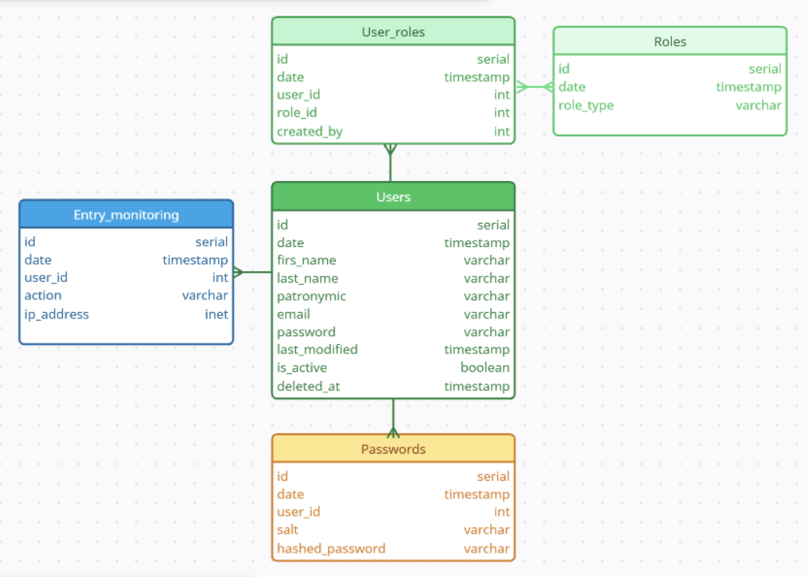

# Проект

## 1. Запуск проекта

### 1.1. Запуск с использованием Docker

1. Клонируйте репозиторий:

    ```bash
    git clone https://github.com/DashaOdnostorontseva/testEffMob/
    cd <папка с проектом>
    ```

2. Построить контейнеры:

    ```bash
    docker-compose up --build
    ```

3. Откройте [http://localhost:8000](http://localhost:8000) в браузере.

---

### 1.2. Установка зависимостей (если не используете Docker)

1. Создайте виртуальное окружение:

    ```bash
    python -m venv venv
    ```

2. Активируйте виртуальное окружение:

    - Windows:
      ```bash
      .\venv\Scripts\activate
      ```

    - macOS/Linux:
      ```bash
      source venv/bin/activate
      ```
3. В файле settings.py (./testEffMob/settings.py) на строке 105 замените 'HOST': 'db' на 'HOST': 'loacalhost'

3. Установите зависимости:

    ```bash
    pip install -r requirements.txt
    ```

4. Выполните миграции:

    ```bash
    python manage.py migrate
    ```
    
5. Заполните базу данных тестовыми данными:

    ```bash
    python loaddata.py
    ```  

6. Запустите сервер:

    ```bash
    python manage.py runserver
    ```
---

## 2. Инструкция по использованию

### 2.1. Пользователи системы

Система поддерживает три роли пользователей:

- **User** — обычный пользователь, имеющий доступ к своему профилю и функционалу для авторизованных пользователей.
- **Operator** — оператор, имеет доступ к странице оператора, а также возможность изменять данные пользователей в системе.
- **Admin** — администратор, имеет доступ ко всем страницам, может изменять пользовательские роли.

#### Примеры аккаунтов, которые уже существуют в системе (если вы выполнили п.1.2 или п.1.5):

- **1 - User**:
  - **Логин**: petr@mail.ru
  - **Пароль**: 123

- **2 - Operator**:
  - **Логин**: ivan@mail.ru
  - **Пароль**: 123

- **3 - Admin**:
  - **Логин**: daria@mail.ru
  - **Пароль**: 333

> Примечание: Администратор может изменять роли всех пользователей в системе.
---

### 2.2. Внутренний функционал системы

Система включает в себя несколько страниц, каждая из которых имеет определенные функции и ограничения доступа:

1. **Авторизация** (Главная страница):
   - Страница, где пользователь может войти в систему или зарегистрироваться.
   - Доступна всем пользователям.

2. **Профиль**:
   - Доступна только авторизованным пользователям для просмотра личной информации.
   - На этой странице доступны кнопки для перехода на другие страницы (например, редактирование профиля, выхож из системы и другие).

3. **Страница администратора**:
   - Страница доступна только авторизованным пользователям с ролью **"Администратор"**.
   - На данной странице администратор может менять роли пользователей системы без использования внешнего API.

4. **Страница оператора**:
   - Страница доступна авторизованным пользователям с ролью **"Оператор"** и **"Администратор"**.
   - Данная страница содержит в себе только текстовое поле.

5. **Страница пользовательская**:
   - Страница доступна только авторизованным пользователям.
   - Данная страница содержит в себе только текстовое поле.

6. **Редактирование профиля**:
   - Доступна авторизованным пользователям.
   - Пользователи могут изменять свои персональные данные, а также менять пароль.
   - При смене пароля происходит автоматический выход из системы и переход на страницу входа.

7. **Удаление профиля**:
   - Когда пользователь удаляет свой профиль, его статус **`is_active`** меняется на **`False`**, что деактивирует его. После чего вход в систему для данного пользователя невозможен.
   - В поле **`deleted_at`** сохраняется время удаления, что позволяет отслеживать момент деактивации профиля.
   - Профиль остается в базе данных, но его можно восстановить, изменив статус на **`True`**. Восстановление профиля возможно путем повторной регистрации в системе с последними **`email`** и **`password`**, которые были сохранены до удаления профиля.

8. **Выход из системы**:
   - При выходе из системы сессия пользователя завершается.
   - После выхода пользователь перенаправляется на главную страницу.

> Примечание: Страницы, описанные в пп. 3, 4 и 5 реализованы для демонстрации работоспособности разграничения пользовательских ролей.
---

### 2.3. Внешний функционал системы

Система реализует **JWT API** (JSON Web Token API), который позволяет пользователям с ролью **"Администратор"** получать данные о всех пользователях в формате JSON.

### API для администратора:
- Администратор может использовать API для получения информации о всех пользователях.
- API доступно только пользователям с ролью **"Администратор"**.

#### Пример запроса:
- На главной странице имеется кнопка для тестирования внешнего API.
- Также можно протестировать API другими способами, например, с помощью Python.

### Пример кода для тестирования API на Python:

```python
import requests

BASE = "http://localhost:8000"  # поменяйте в зависимости от метода запуска системы (п.1)
TOKEN_URL = f"{BASE}/api/token/"
USERS_URL = f"{BASE}/external/users/"
UPDATE_ROLE_URL = f"{BASE}/external/update_role/"

ADMIN_ROLE = "admin"
OPER_ROLE = "operator"
USER_ROLE = "user"

TIMEOUT = 10

email = "daria@mail.ru"
password = "333"

payload = {"email": email, "password": password}
r = requests.post(TOKEN_URL, json=payload, timeout=TIMEOUT)
r.raise_for_status()  # выбросит исключение для 4xx/5xx
data = r.json()

print("Access token:", data)

######################################################

access_token = data["access"]
headers = {"Authorization": f"Bearer {access_token}"}
r = requests.get(USERS_URL, headers=headers, timeout=TIMEOUT)
r.raise_for_status()
res = r.json()
print(res)

######################################################

headers = {"Authorization": f"Bearer {access_token}", "Content-Type": "application/json"}
payload = {"user_id": "3", "role_type": USER_ROLE} # вы можете использовать другие данные
r = requests.post(UPDATE_ROLE_URL, headers=headers, json=payload, timeout=TIMEOUT)
r.raise_for_status()
r.json()
```
---

## 3. База данных



В проекте используется несколько моделей для управления пользователями, ролями, историей паролей, мониторингом действий и прочими сущностями.

### 3.1. Модель Users (Пользователи)

Модель **`Users`** представляет пользователей системы и наследуется от **`AbstractBaseUser`**, что позволяет кастомизировать процесс аутентификации.

#### Поля:
- **`date`**: Дата и время создания пользователя (автоматически устанавливается).
- **`first_name`**: Имя пользователя.
- **`last_name`**: Фамилия пользователя.
- **`patronymic`**: Отчество пользователя (опционально).
- **`email`**: Электронная почта пользователя (уникальное поле).
- **`password`**: Хэшированный пароль пользователя.
- **`last_modified`**: Дата и время последнего изменения данных пользователя.
- **`is_active`**: Флаг активности пользователя (по умолчанию `True`).
- **`deleted_at`**: Дата и время мягкого удаления пользователя (если применимо).

---

### 3.2. Модель Roles (Роли)

Модель **`Roles`** представляет различные роли пользователей в системе.

#### Поля:
- **`date`**: Дата и время создания роли (автоматически устанавливается).
- **`role_type`**: Тип роли ("user", "operator", "admin").

---

### 3.3. Модель UserRoles (Роли пользователей)

Модель **`UserRoles`** представляет связь между пользователями и ролями. Она позволяет назначать одну пользоветальскую роль, а также проследить изменения ролей у пользователя.

#### Поля:
- **`date`**: Дата и время назначения роли (автоматически устанавливается).
- **`user`**: Внешний ключ на модель **`Users`** (пользователь).
- **`role`**: Внешний ключ на модель **`Roles`** (роль).
- **`created_by`**: Внешний ключ на модель **`Users`** (пользователь, который назначил роль). Может быть **`NULL`**.

---

### 3.4. Модель Passwordd (Пароли)

Модель **`Passwords`** хранит исторические пароли пользователей. Это позволяет отслеживать старые пароли, а также предотвратить их повторное использование.

#### Поля:
- **`date`**: Дата и время сохранения пароля (автоматически устанавливается).
- **`user`**: Внешний ключ на модель **`Users`** (пользователь).
- **`salt`**: Соль для хэширования пароля (необходимо для сверки "нового" и "старого" пароля в дальнейшем - см. [TO DO](#TODO)).
- **`hashed_password`**: Хэшированный пароль.

---

### 3.5. Модель EntryMonitoring (Мониторинг действий)

Модель **`EntryMonitoring`** используется для мониторинга действий пользователей в системе. Она записывает информацию о том, какие действия были выполнены пользователем, а также его IP-адрес.

### Поля:
- **`date`**: Дата и время действия.
- **`user`**: Внешний ключ на модель **`Users`** (пользователь).
- **`action`**: Описание действия, которое выполнил пользователь.
- **`ip_address`**: IP-адрес пользователя, с которого было выполнено действие.

---

## 4. Сущности системы


---

## TODO

### 1. Уровневая система доступа в расширенных сущностях

Система разработана с учетом будущего расширения при релализации других сущностей системы (например, **деревья файлов** или **узлы деревьев**). Для каждой из этих сущностей будет определен свой **`ACCESS_LEVEL`**.

- В системе три роли: **`user (id = 1)`**, **`operator (id = 2)`**, **`admin (id = 3)`**
- **`ACCESS_LEVEL`** будет определять, какая роль необходима пользователю для взаимодействия с определенной сущностью (например, деревом или его узлом).
- Каждая сущность, например **`fileTree`**, **`systemFiles`**, **`userFiles`**, или **`officeFiles`**, будет иметь свой заранее определенный (заданный, как константа) **`ACCESS_LEVEL`**, который будет сравниваться с ролью пользователя перед предоставлением доступа.

Пример работы с сущностями и уровнями доступа:

1. Каждому дереву и(или) узлу дерева (например, будут созданы узлы - **`systemFiles`**, **`userFiles`** или **`officeFiles`**) будет присвоен **`ACCESS_LEVEL`**.
2. Когда пользователь захочет просматривать или взаимодействовать с узлом в дереве, система сначала сравнит его user_role_id и **`ACCESS_LEVEL`** сущности.
3. Если роль пользователя позволяет доступ к этому узлу (т.е. id пользовательской роли >= нужного уровня для узла), то доступ будет предоставлен.

---

### 2. Работа над пользовательскими паролями

Для улучшения безопасности системы необходимо реализовать механизм проверки пароля, который предотвратит использование **старых паролей** и обеспечит минимальные требования к сложности пароля, а именно:

- Реализовать проверку, чтобы пользователь не мог использовать свой **предыдущий пароль** при создании нового пароля. Для этого используется таблица **`Passwords`**, которая хранит историю паролей пользователей. При попытке установить новый пароль, система должна проверять его с предыдущими паролями в таблице и блокировать создание пароля, если он совпадает с одним из старых.
- При восстановлении пароля пользователь должен ввести хотя бы один из старых паролей (или тот, который он помнит) для дополнительной проверки.
- Необходимо реализовать требования к сложности пароля, такие как наличие прописных и строчных букв, цифр, специальных символов (например, `@`, `#`, `%`, `&`)

### 3. Заполнять таблицу entryMonitoring

Необходимо обеспечить заполнение таблицы **`EntryMonitoring`** для мониторинга действий пользователей в системе. Для реализации данного функционала необходимо реализовать запись данных в таблицу **`EntryMonitoring`** при каждом действии пользователя (например, при авторизации, выходе из системы, изменении данных профиля и т.д.). 

Данный подход позволит оперативно отслеживать аномальные активности, например, частые попытки входа с разных IP-адресов, что может свидетельствовать о попытках взлома.

### 3. Возможность создания администратора

Для удобства управления системой и обеспечения первого доступа к функционалу администрирования необходимо реализовать возможность автоматического создания **пользователя с ролью "Администратор"** при запуске системы (сейчас это реализовано через подгрузку данных в БД). Реализация данного функционала возможна, например, через добавление вызова метода во views.py:

- При старте системы необходимо проверить, существует ли уже пользователь с ролью "Администратор".
- Если пользователя с ролью "Администратор" не существует, создается новый с заранее заданными данными (например, логин, пароль и роль).


### 4. Предоставить администраторам возможность "мягко" удалять пользователей

Необходимо предоставить пользователям с ролью **"Администратор"** возможность **мягкого удаления пользователей** из системы. Это позволит администраторам деактивировать пользователей, например, сотрудников, которые уволились.